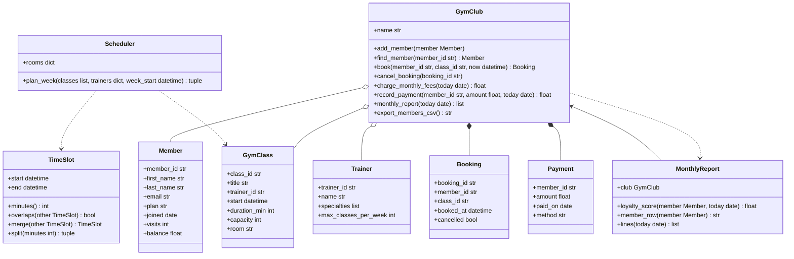

# UML class

```mermaid
classDiagram
    class Member {
        +member_id str
        +first_name str
        +last_name str
        +email str
        +plan str
        +joined date
        +visits int
        +balance float
    }
    class Trainer {
        +trainer_id str
        +name str
        +specialties list
        +max_classes_per_week int
    }
    class GymClass {
        +class_id str
        +title str
        +trainer_id str
        +start datetime
        +duration_min int
        +capacity int
        +room str
    }
    class Booking {
        +booking_id str
        +member_id str
        +class_id str
        +booked_at datetime
        +cancelled bool
    }
    class Payment {
        +member_id str
        +amount float
        +paid_on date
        +method str
    }
    class TimeSlot {
        +start datetime
        +end datetime
        +minutes() int
        +overlaps(other TimeSlot) bool
        +merge(other TimeSlot) TimeSlot
        +split(minutes int) tuple
    }
    class Scheduler {
        +rooms dict
        +plan_week(classes list, trainers dict, week_start datetime) tuple
    }
    class GymClub {
        +name str
        +add_member(member Member)
        +find_member(member_id str) Member
        +book(member_id str, class_id str, now datetime) Booking
        +cancel_booking(booking_id str)
        +charge_monthly_fees(today date) float
        +record_payment(member_id str, amount float, today date) float
        +monthly_report(today date) list
        +export_members_csv() str
    }
    class MonthlyReport {
        +club GymClub
        +loyalty_score(member Member, today date) float
        +member_row(member Member) str
        +lines(today date) list
    }
    GymClub o-- Member
    GymClub o-- Trainer
    GymClub o-- GymClass
    GymClub *-- Booking
    GymClub *-- Payment
    GymClub ..> MonthlyReport
    MonthlyReport --> GymClub
    Scheduler ..> GymClass
    Scheduler ..> TimeSlot
```
