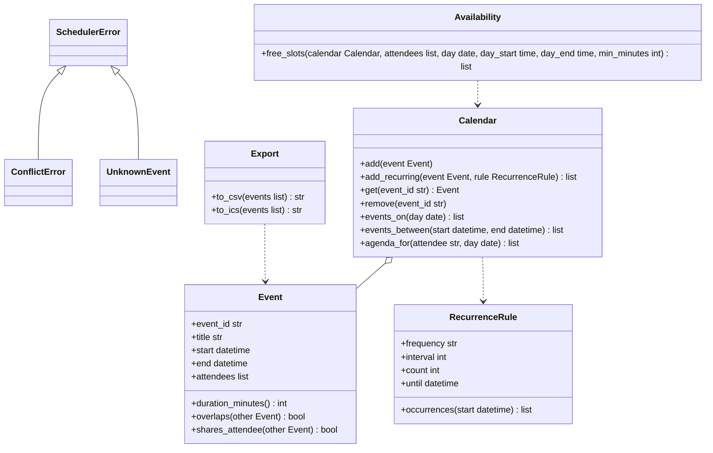

# UML class

```mermaid
classDiagram
    class SchedulerError {
    }
    class ConflictError {
    }
    class UnknownEvent {
    }
    SchedulerError <|-- ConflictError
    SchedulerError <|-- UnknownEvent

    class Event {
        +event_id str
        +title str
        +start datetime
        +end datetime
        +attendees list
        +duration_minutes() int
        +overlaps(other Event) bool
        +shares_attendee(other Event) bool
    }
    class RecurrenceRule {
        +frequency str
        +interval int
        +count int
        +until datetime
        +occurrences(start datetime) list
    }
    class Calendar {
        +add(event Event)
        +add_recurring(event Event, rule RecurrenceRule) list
        +get(event_id str) Event
        +remove(event_id str)
        +events_on(day date) list
        +events_between(start datetime, end datetime) list
        +agenda_for(attendee str, day date) list
    }
    class Availability {
        +free_slots(calendar Calendar, attendees list, day date, day_start time, day_end time, min_minutes int) list
    }
    class Export {
        +to_csv(events list) str
        +to_ics(events list) str
    }

    Calendar o-- Event
    Calendar ..> RecurrenceRule
    Availability ..> Calendar
    Export ..> Event
```
