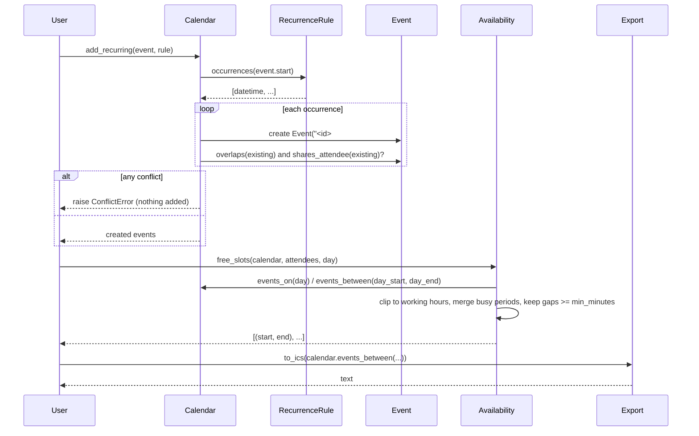

# UML sequence

```mermaid
sequenceDiagram
    participant User
    participant Cal as Calendar
    participant RR as RecurrenceRule
    participant Ev as Event
    participant Av as Availability
    participant Ex as Export

    User->>Cal: add_recurring(event, rule)
    Cal->>RR: occurrences(event.start)
    RR-->>Cal: [datetime, ...]
    loop each occurrence
        Cal->>Ev: create Event("<id>#n", same title, duration, attendees)
        Cal->>Ev: overlaps(existing) and shares_attendee(existing)?
    end
    alt any conflict
        Cal-->>User: raise ConflictError (nothing added)
    else
        Cal-->>User: created events
    end

    User->>Av: free_slots(calendar, attendees, day)
    Av->>Cal: events_on(day) / events_between(day_start, day_end)
    Av->>Av: clip to working hours, merge busy periods, keep gaps >= min_minutes
    Av-->>User: [(start, end), ...]

    User->>Ex: to_ics(calendar.events_between(...))
    Ex-->>User: text
```
