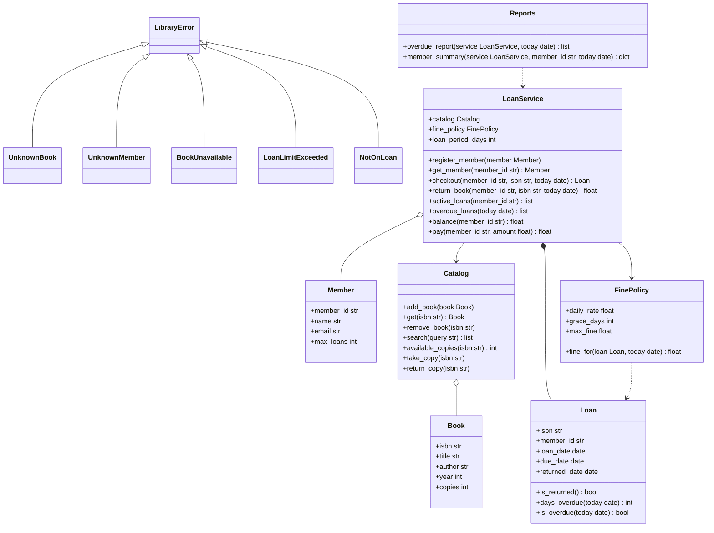

# UML class

```mermaid
classDiagram
    class LibraryError {
    }
    class UnknownBook {
    }
    class UnknownMember {
    }
    class BookUnavailable {
    }
    class LoanLimitExceeded {
    }
    class NotOnLoan {
    }
    LibraryError <|-- UnknownBook
    LibraryError <|-- UnknownMember
    LibraryError <|-- BookUnavailable
    LibraryError <|-- LoanLimitExceeded
    LibraryError <|-- NotOnLoan

    class Book {
        +isbn str
        +title str
        +author str
        +year int
        +copies int
    }
    class Member {
        +member_id str
        +name str
        +email str
        +max_loans int
    }
    class Loan {
        +isbn str
        +member_id str
        +loan_date date
        +due_date date
        +returned_date date
        +is_returned() bool
        +days_overdue(today date) int
        +is_overdue(today date) bool
    }
    class Catalog {
        +add_book(book Book)
        +get(isbn str) Book
        +remove_book(isbn str)
        +search(query str) list
        +available_copies(isbn str) int
        +take_copy(isbn str)
        +return_copy(isbn str)
    }
    class FinePolicy {
        +daily_rate float
        +grace_days int
        +max_fine float
        +fine_for(loan Loan, today date) float
    }
    class LoanService {
        +catalog Catalog
        +fine_policy FinePolicy
        +loan_period_days int
        +register_member(member Member)
        +get_member(member_id str) Member
        +checkout(member_id str, isbn str, today date) Loan
        +return_book(member_id str, isbn str, today date) float
        +active_loans(member_id str) list
        +overdue_loans(today date) list
        +balance(member_id str) float
        +pay(member_id str, amount float) float
    }
    class Reports {
        +overdue_report(service LoanService, today date) list
        +member_summary(service LoanService, member_id str, today date) dict
    }

    Catalog o-- Book
    LoanService --> Catalog
    LoanService --> FinePolicy
    LoanService o-- Member
    LoanService *-- Loan
    FinePolicy ..> Loan
    Reports ..> LoanService
```
