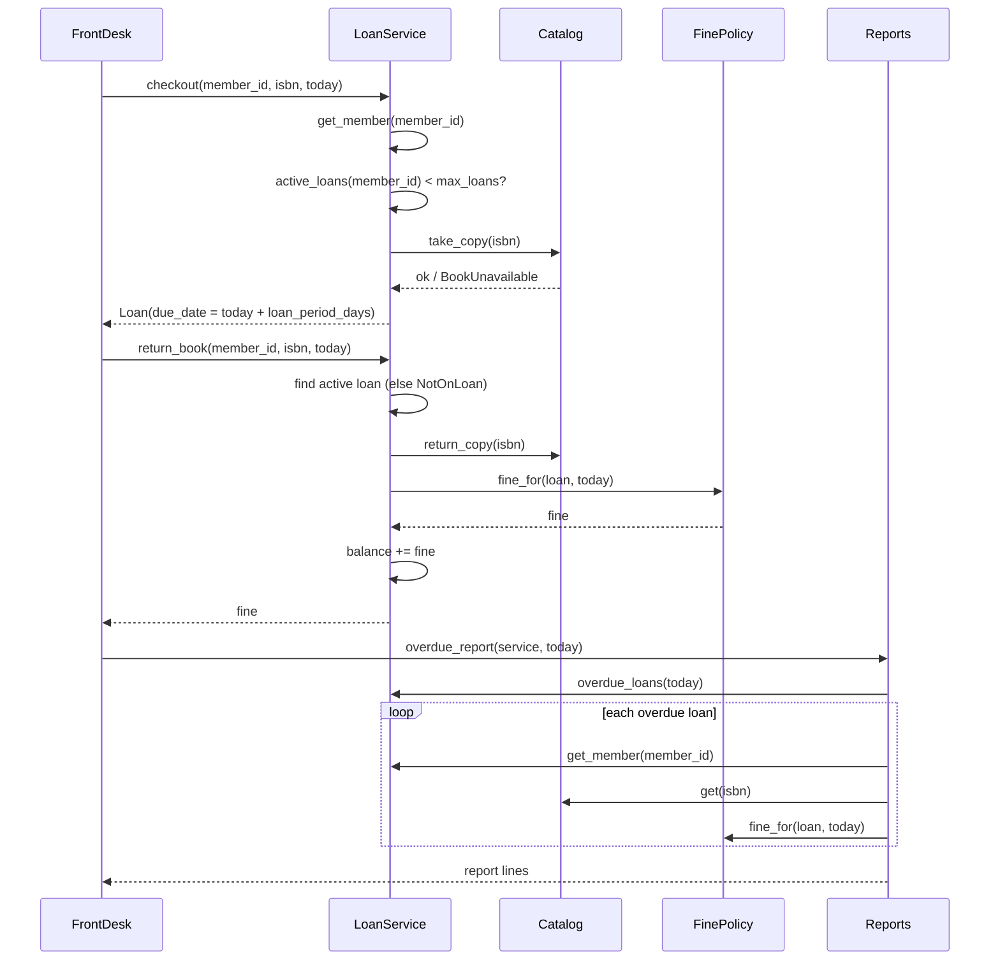

# UML sequence

```mermaid
sequenceDiagram
    participant Desk as FrontDesk
    participant LS as LoanService
    participant Cat as Catalog
    participant FP as FinePolicy
    participant Rep as Reports

    Desk->>LS: checkout(member_id, isbn, today)
    LS->>LS: get_member(member_id)
    LS->>LS: active_loans(member_id) < max_loans?
    LS->>Cat: take_copy(isbn)
    Cat-->>LS: ok / BookUnavailable
    LS-->>Desk: Loan(due_date = today + loan_period_days)

    Desk->>LS: return_book(member_id, isbn, today)
    LS->>LS: find active loan (else NotOnLoan)
    LS->>Cat: return_copy(isbn)
    LS->>FP: fine_for(loan, today)
    FP-->>LS: fine
    LS->>LS: balance += fine
    LS-->>Desk: fine

    Desk->>Rep: overdue_report(service, today)
    Rep->>LS: overdue_loans(today)
    loop each overdue loan
        Rep->>LS: get_member(member_id)
        Rep->>Cat: get(isbn)
        Rep->>FP: fine_for(loan, today)
    end
    Rep-->>Desk: report lines
```
