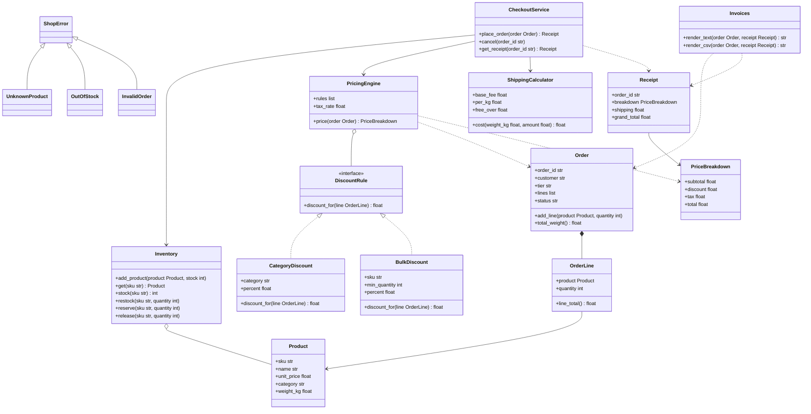

# UML class

```mermaid
classDiagram
    class ShopError {
    }
    class UnknownProduct {
    }
    class OutOfStock {
    }
    class InvalidOrder {
    }
    ShopError <|-- UnknownProduct
    ShopError <|-- OutOfStock
    ShopError <|-- InvalidOrder

    class Product {
        +sku str
        +name str
        +unit_price float
        +category str
        +weight_kg float
    }
    class Inventory {
        +add_product(product Product, stock int)
        +get(sku str) Product
        +stock(sku str) int
        +restock(sku str, quantity int)
        +reserve(sku str, quantity int)
        +release(sku str, quantity int)
    }
    class OrderLine {
        +product Product
        +quantity int
        +line_total() float
    }
    class Order {
        +order_id str
        +customer str
        +tier str
        +lines list
        +status str
        +add_line(product Product, quantity int)
        +total_weight() float
    }
    class DiscountRule {
        <<interface>>
        +discount_for(line OrderLine) float
    }
    class CategoryDiscount {
        +category str
        +percent float
        +discount_for(line OrderLine) float
    }
    class BulkDiscount {
        +sku str
        +min_quantity int
        +percent float
        +discount_for(line OrderLine) float
    }
    class PriceBreakdown {
        +subtotal float
        +discount float
        +tax float
        +total float
    }
    class PricingEngine {
        +rules list
        +tax_rate float
        +price(order Order) PriceBreakdown
    }
    class ShippingCalculator {
        +base_fee float
        +per_kg float
        +free_over float
        +cost(weight_kg float, amount float) float
    }
    class Receipt {
        +order_id str
        +breakdown PriceBreakdown
        +shipping float
        +grand_total float
    }
    class CheckoutService {
        +place_order(order Order) Receipt
        +cancel(order_id str)
        +get_receipt(order_id str) Receipt
    }
    class Invoices {
        +render_text(order Order, receipt Receipt) str
        +render_csv(order Order, receipt Receipt) str
    }

    Inventory o-- Product
    Order *-- OrderLine
    OrderLine --> Product
    DiscountRule <|.. CategoryDiscount
    DiscountRule <|.. BulkDiscount
    PricingEngine o-- DiscountRule
    PricingEngine ..> Order
    PricingEngine ..> PriceBreakdown
    CheckoutService --> Inventory
    CheckoutService --> PricingEngine
    CheckoutService --> ShippingCalculator
    CheckoutService ..> Receipt
    Receipt --> PriceBreakdown
    Invoices ..> Order
    Invoices ..> Receipt
```
